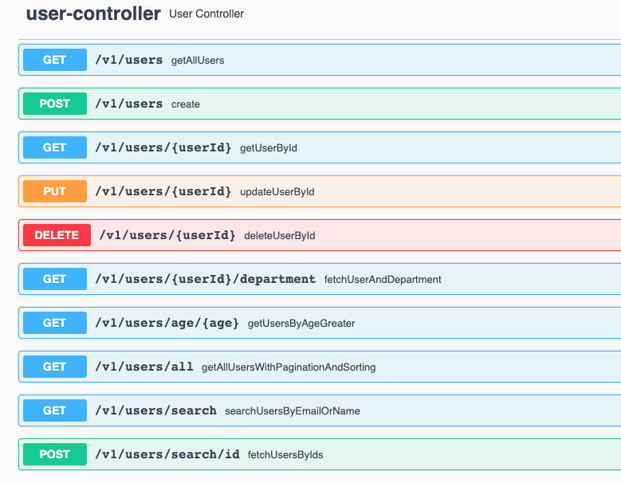

# Spring Boot Rest API with WebFlux, R2dbc, PostgreSQL, H2, Swagger 

## Business function
A Rest API for user management for managing users in a PostgreSQL database.

It demonstrates the usage of Reactive Spring Boot with Spring WebFlux. It makes uses of R2dbc to interact with the database in non-blocking reactive way.

## Architectural information

The architecture is simple. Rest requests are retrieved through Spring Controller. The Controller gets the API request and makes call to Services to construct the request response. Services make use of Spring Repository and Models. Spring Repository makes reactive non-blocking calls to the PostgreSQL.

Below we describe which and why the specific component are used.

**Java Spring Boot:** Fast, easy to implement. Lot's of features. A strong community behind.

**Spring WebFlux:** Spring library for reactive programming. Reactive implementations are faster, non-blocking with optimised thread pools. It uses less memory.

**PostgreSQL:** Used to persist the data in a relational database (when the Spring profile is either `dev` or `prod`). Any persistent data-store would be okay for this application.

**H2:** Used as the in-memory db, when the Spring profile is `test`.

**Swagger:** Used for out-of-the box user-friendly API documentation based on the OpenAPI standards.

**Maven:** Build automation tool for Java projects. Alternative would be Gradle. 

**Spotless:** Google code formatting.

## Pre-requisites for development

- Java 8 or higher. This code is tested on Java 17.
- Docker and Docker Compose
- A PostgreSQL instance. It is covered in `docker-compose.yml` file.
- Maven if you need to run the application locally. Otherwise use docker. 

## Configuration options
By default, configurations are kept under `src/main/resources/application.yml` file. 

The configurations can be overriden by the environment variables. For instance `application.yml` has `app.dbhost` configuration which tells the API where is the PostgreSQL host. You can override that value by 
setting `APP_DBHOST` environment variable through shell. You can also pass the configurations to Docker using the ENV syntax. 
There should be some examples in the `docker-compose.yml` file.

Some of the important configurations are:

- Spring profiles
- Database configurations
- Logging level

## Build and run
It uses JDK-17. It should run on any Java version > 8 (not tested though).  

### How to run with Docker
From the terminal, go into the project root directory and run the docker compose command below:

`docker-compose up` 

The service starting time can take a few minute on the first start as it needs to download Docker images and Maven packages. It should be fast on subsequent runs.

Leave the docker console running.

The API starts at `localhost:8080`, so the Port `8080` on your local machine has to be free.

### How to run on local machine
A PostgreSQL instance must be available at `localhost:5432`. If not, run below command to spin-up a PostgreSQL instance with docker:

`docker-compose up db`

Run the API with an IDE or with maven:

`mvn clean package`

`java -jar target/user-management*.jar`

API starts at `localhost:8080`, so the Port `8080` on your local machine has to be free.

### Test the API using Swagger
Open up a browser. Use below Swagger-URL: 

http://localhost:8080/swagger-ui/index.html#/user-controller

### Test the API using Postman or Curl requests on Terminal

You can do the followings with the API:

- Get the list of all users in the system: 

   `curl -X GET "http://localhost:8080/v1/users" -H "accept: */*"`

- Fetch all the users with pagination and sorting.
  
   The query below fetches page 2 with page-size being 5. It sorts the results by name in ascending order and ID in descending order.

   `curl -X GET "http://localhost:8080/v1/users/all?page=2&size=5&sort=name%3Basc%2Cid%3Bdesc" -H "accept: */*"`

- Search users by (email (exact-match) OR name (prefix-match):

  `curl -X GET "http://localhost:8080/v1/users/search?email=ljames%40company.com&name=lebro" -H "accept: */*"`

  It does some text sanitizations in the background.

- Create a new user:

  `curl -X POST "http://localhost:8080/v1/users" -H "accept: */*" -H "Content-Type: application/json" -d "{ \"age\": 40, \"email\": \"johndoe@company.com\", \"name\": \"John Doe\", \"salary\": 10000}"`

   Please notice the validation rules.

- Get a specific user by its ID:

  `curl -X GET "http://localhost:8080/v1/users/5" -H "accept: */*"`

- Fetch a list of users with list of IDs:

  `curl -X POST "http://localhost:8080/v1/users/search/id" -H "accept: */*" -H "Content-Type: application/json" -d "[ 1, 5, 10]"`

- Update a user by its ID and the new user data:

  `curl -X PUT "http://localhost:8080/v1/users/5" -H "accept: */*" -H "Content-Type: application/json" -d "{ \"age\": 50, \"email\": \"modified_albeins@company.com\", \"name\": \"Albert Einstein\", \"salary\": 40000}"`

- Delete a user by ID:

  `curl -X DELETE "http://localhost:8080/v1/users/10" -H "accept: */*"`

- Fetch user and his/her department info:

  `curl -X GET "http://localhost:8080/v1/users/1/department" -H "accept: */*"`

- Fetch users older than a given age:

  `curl -X GET "http://localhost:8080/v1/users/age/30" -H "accept: */*"`

Please use Swagger end-point above if you are not comfortable with Curl requests.

### Test the API using Java Unit Tests

Extensive tests are written under `src/test/APITest.java` class. You can run the existing tests there or write your own. 
To run the tests either use an IDE or maven commands. Check https://mkyong.com/maven/how-to-run-unit-test-with-maven/ for more details. 

## How to monitor the application

Spring Boot Actuator is enabled. So below GET request will tell you about the health of the API:

http://localhost:8080/actuator/health

Check what other actuator endpoints available through:

http://localhost:8080/actuator

Also, Kubernetes health probes are enabled. So, when the API is deployed to Kubernetes, `readiness` and `liveness` checks are useful:

http://localhost:8080/actuator/health/readiness

http://localhost:8080/actuator/health/liveness

Note that, on production, only the `/actuator/health/*` endpoint is enabled.

In addition,  the terminal console logs or docker container logs should give plenty of information for monitoring. 
Of course this wouldn't be enough if this was a production system. 
Ideally if this was a production system:
- I would have packaged the application in Dockerfile with a monitoring agent, such as Datadog Java Agent.
- Customise Kubernetes readiness and healthiness probes
- I would have created dashboards, metrics, monitors and necessary alarms using something like ELK stack, Datadog or Grafana. 

## Production consideration

If you need to deploy this to a production environment, I would suggest:

- Customise API Request and Response objects

- Add Chain of Responsibility pattern

- Add better API versioning

- Splitting the API client part and API logic part, such that API client includes requests and responses definitons and API logic includes the processing logic. 
This way, we can package API client separately as a library and share it with the consumers.

- Setting the Cloud infrastructure that this app would run through Terraform

- Creating the CI/CD pipelines using Jenkins

- Build the docker versioned images for the app and publish to internal Container Registry

- Create the Kubernetes Helm Charts for the published docker images to be referenced and run in Pods

- Monitoring, dashboards, alarms

- Secure DB managements and connections.

- And a lot more to consider

## References

https://www.baeldung.com/spring-webflux 

https://docs.oracle.com/javase/8/docs/api/java/util/stream/Stream.html

https://spring.io/blog/2016/11/28/going-reactive-with-spring-data

https://spring.io/guides/gs/rest-service/

https://spring.io/guides/tutorials/rest/

https://www.baeldung.com/spring-boot-h2-database

https://github.com/vinsguru/vinsguru-blog-code-samples/tree/master/r2dbc/r2dbc-pagination

https://www.vinsguru.com/r2dbc-pagination/

https://www.baeldung.com/spring-jpa-like-queries

https://dassum.medium.com/building-a-reactive-restful-web-service-using-spring-boot-and-postgres-c8e157dbc81d

https://www.baeldung.com/spring-response-entity

https://graspingtech.com/docker-compose-postgresql/

